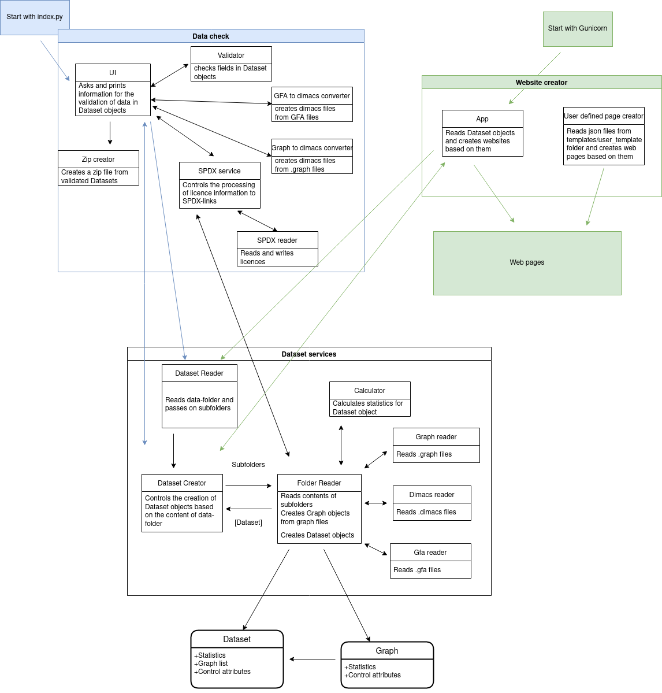

# Architecture document

The program creates a static website based on files added to the docker volume (see user manual for more instructions). Each time information is modified, the data has to be validated, and a new website generated.

The architecture is divided into three parts: Data check, Website creator and Dataset services

Data validation is started by running index.py, website creation by Gunicorn

Dataset services reads the data folder and creates dataset objects based on its contents.

Data check validates the data in the dataset objects and in the data folder by calling dataset services, asking for input for datasets which don't have full information present. It marks all validated datasets as dataset folders as ready to show on the website.

Website creator uses dataset services to get dataset objects which are validated by the data check. It then creates web pages from those objects. It also reads the files for user generated pages if present, and creates pages according to them.
